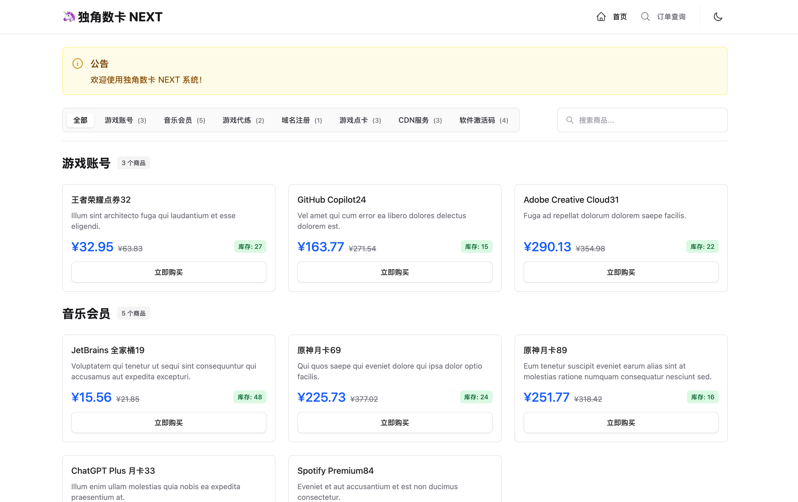
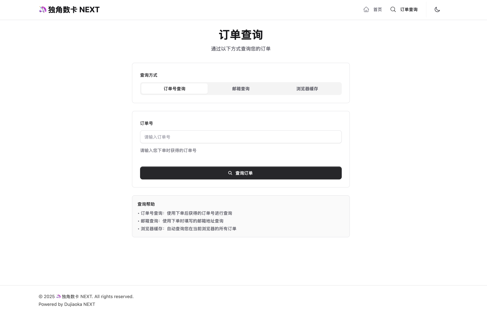
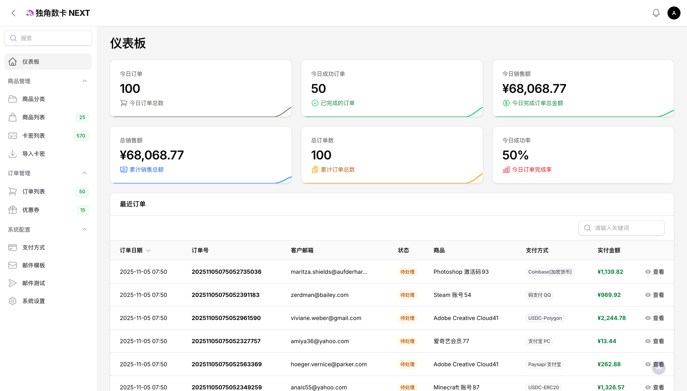
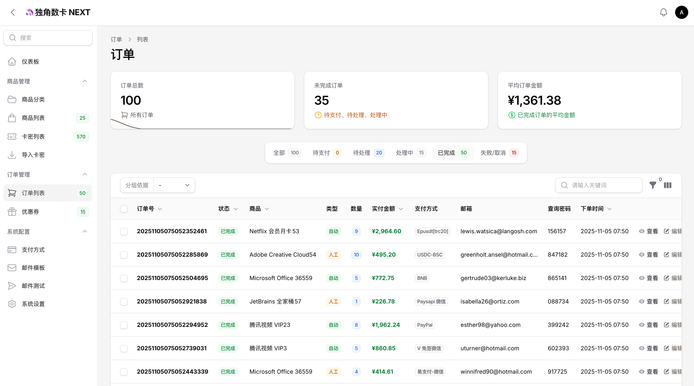
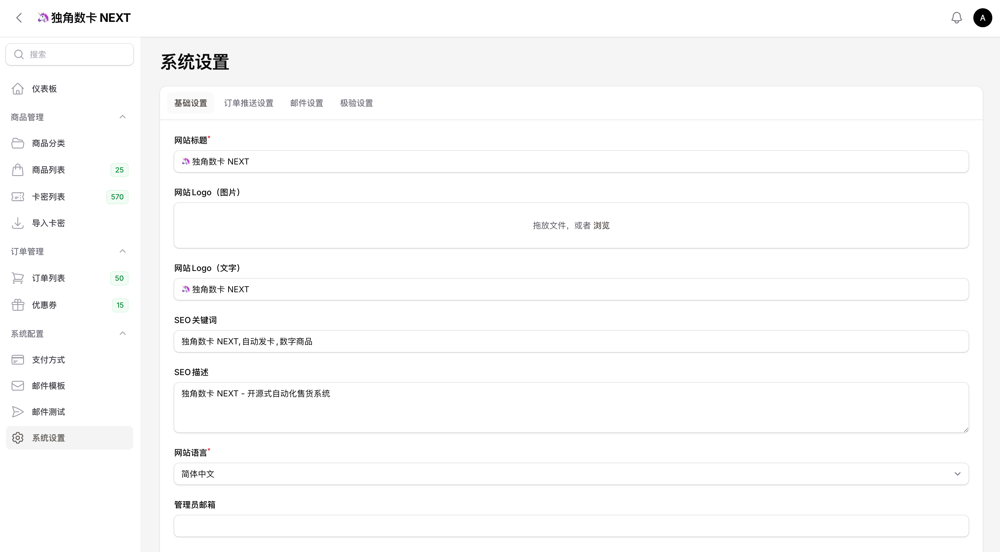

# 🦄 独角数卡 NEXT

> 从 Laravel 6 + dcat-admin 升级到 Laravel 12 + Filament 4 的现代化（船新）版本

## ✨ 特性

### 🎨 前端升级
- **现代化 UI**: Tailwind CSS 4 + Flux UI 组件
- **全栈组件**: Livewire 3 无刷新交互
- **暗色模式**: 完整的 Dark Mode 支持
- **用户体验**: 商品分类导航、卡密一键复制、实时搜索

### 🔧 后端升级
- **管理面板**: Filament 4 现代化后台
- **PHP 8.3+**: 严格类型声明、构造函数属性提升
- **Laravel 12**: 最新的 Laravel 框架特性
- **代码规范**: Laravel Pint 自动格式化

### 📦 核心功能
- ✅ 商品管理（分类、商品、库存、批发价）
- ✅ 订单管理（自动/人工发货、订单查询）
- ✅ 卡密管理（导入/导出、循环使用）
- ✅ 优惠券系统（商品关联、使用限制）
- ✅ 34种支付网关（支付宝、微信、PayPal、Stripe、加密货币等）
- ✅ 邮件通知系统（5种邮件模板）
- ✅ 多渠道推送（Telegram、Server酱、Bark、企业微信）
- ✅ 数据统计 Dashboard
- ✅ 系统配置管理（缓存自动恢复）

## 🚀 快速开始

### 新系统安装

```bash
# 1. 克隆项目
git clone https://github.com/myxiaoao/dujiaoka-next.git
cd dujiaoka-next

# 2. 安装 PHP 依赖
composer install

# 3. 安装前端依赖
npm install

# 4. 配置环境
cp .env.example .env
php artisan key:generate

# 5. 配置数据库和缓存（编辑 .env 文件）
# 数据库配置
# DB_CONNECTION=mysql
# DB_HOST=127.0.0.1
# DB_PORT=3306
# DB_DATABASE=dujiaoka_next
# DB_USERNAME=root
# DB_PASSWORD=

# Redis 缓存配置（必需！系统配置存储在 Redis 中）
# CACHE_STORE=redis
# REDIS_HOST=127.0.0.1
# REDIS_PORT=6379
# REDIS_PASSWORD=null

# 6. 运行迁移并初始化数据
php artisan migrate --seed

# --seed 会自动初始化：
# - EmailTemplateSeeder: 5个邮件模板
# - PaySeeder: 34个支付网关配置
# - SystemSettingSeeder: 系统默认配置

# 7. 创建管理员账户
php artisan make:filament-user

# 8. 编译前端资源
npm run build

# 9. 启动开发服务器
composer dev
# 或分别启动：
# php artisan serve
# php artisan queue:listen
# npm run dev

# 访问前台: http://localhost:8000
# 访问后台: http://localhost:8000/admin
```

### 开发环境测试数据

开发时可以生成测试数据用于调试和演示：

```bash
# 生成测试数据（商品、订单、卡密、优惠券等）
php artisan db:seed --class=TestDataSeeder

# 清空测试数据（上线前使用）
php artisan test-data:clear

# 强制清空（不需要确认）
php artisan test-data:clear --force
```

详细说明见 [测试数据文档](docs/TEST_DATA.md)

### 从老系统升级

```bash
# 自动化升级（推荐）
php artisan dujiaoka:upgrade \
  --host=localhost \
  --database=old_dujiaoka \
  --username=root \
  --password=your_password \
  --old-path=/path/to/old/dujiaoka

# 升级命令会自动：
# - 迁移所有数据表（商品、订单、卡密、优惠券等）
# - 复制上传文件（图片、附件）
# - 保留用户数据和支付配置

# 详细文档
# - docs/UPGRADE_GUIDE.md
# - docs/development-logs/UPGRADE_QUICKSTART.md
# - docs/development-logs/MIGRATION_SUMMARY.md
```

## 📚 文档

### 📖 核心文档
- **[完整升级指南](docs/UPGRADE_GUIDE.md)** - 从 Laravel 6 升级详细步骤
- **[前端功能文档](docs/FRONTEND_FEATURES.md)** - 前端页面和功能说明
- **[配置管理指南](docs/CONFIGURATION.md)** - 系统配置说明
- **[数据库初始化说明](docs/DATABASE_SEEDING.md)** - Seeders 详解
- **[测试数据生成指南](docs/TEST_DATA.md)** - 开发测试数据
- **[部署指南](docs/DEPLOYMENT_GUIDE.md)** - 生产环境部署

### 🔧 开发者文档
- **[CLAUDE.md](CLAUDE.md)** - AI 辅助开发指南
- **[Flux UI 迁移指南](docs/FLUX_MIGRATION_GUIDE.md)** - Livewire 3 + Flux UI 前端迁移
- **[开发日志](docs/development-logs/)** - 迁移过程详细文档
- **[更多文档](docs/)** - 文档中心

## 🛠 技术栈

### 后端
- **PHP** >= 8.3 (严格类型、构造函数属性提升)
- **Laravel** 12.x (最新 LTS)
- **Filament** 4.x (现代化管理面板)
- **Livewire** 3.x (全栈组件)
- **MySQL** >= 5.7 / MariaDB >= 10.3
- **Redis** (必需，系统配置存储)

### 前端
- **Tailwind CSS** 4.x (原子化 CSS)
- **Flux UI** (Livewire 免费组件)
- **Alpine.js** 3.x (轻量级 JS 框架，Livewire 内置)
- **Vite** (前端构建工具)

### 工具
- **Laravel Pint** (代码格式化)
- **Pest** (测试框架)
- **Larastan** (静态分析，可选)

## 🎯 核心改进

### 对比原系统 (dujiaoka)

| 功能         | 原系统                  | Next 版本                     | 改进          |
|------------|----------------------|-----------------------------|-------------|
| **后端框架**   | Laravel 6            | Laravel 12+                 | ✅ 6个大版本跃升   |
| **管理面板**   | Dcat Admin           | Filament 4                  | ✅ 现代化 UI/UX |
| **前端框架**   | Bootstrap 4 + jQuery | Tailwind CSS 4 + Livewire 3 | ✅ 无刷新交互     |
| **PHP 版本** | 7.4+                 | 8.3+                        | ✅ 性能提升 30%+ |
| **主题系统**   | 3个主题                 | 单一现代主题 + 暗色模式               | ✅ 统一体验      |
| **卡密显示**   | ❌ 仅邮箱                | ✅ 页面直接显示 + 复制               | ✅ 用户体验提升    |
| **分类导航**   | Tab 切换               | Livewire 实时过滤               | ✅ 性能优化      |
| **代码规范**   | 混合风格                 | PSR-12 + Laravel Pint       | ✅ 统一规范      |
| **安装方式**   | Web 安装向导             | 命令行安装                       | ✅ 更安全       |

### 截图

#### **前台**
**首页**


**订单查询**


#### **后台**
**仪表板**


**订单列表**


**系统设置**


#### **[更多截图](art/)** 


## 🤝 贡献

欢迎提交 Issue 和 Pull Request！

## 📄 许可证

继承原 [dujiaoka](https://github.com/assimon/dujiaoka) 项目许可证

## 🙏 致谢

- 原作者 [assimon](https://github.com/assimon) 开创的独角数卡项目
- [Laravel](https://laravel.com) 框架
- [Filament](https://filamentphp.com) 管理面板
- [Livewire](https://livewire.laravel.com) 全栈框架

## 📝免责声明

独角数卡 NEXT 程序是免费开源的产品，仅用于学习交流使用！       
不可用于任何违反`中华人民共和国(含台湾省)`或`使用者所在地区`法律法规的用途。      
因为作者即本人仅完成代码的开发和开源活动`(开源即任何人都可以下载使用)`，从未参与用户的任何运营和盈利活动。    
且不知晓用户后续将`程序源代码`用于何种用途，故用户使用过程中所带来的任何法律责任即由用户自己承担。   
